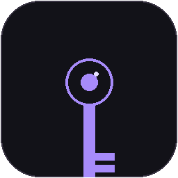

# TokenVault

### 開源 API Token 管理器 — 為開發者而生

<p align="center">
  
</p>

TokenVault 是一款專為開發者設計的 **API 密鑰管理工具**。不同於一般密碼管理器，TokenVault 從頭建構了開發者真正需要的功能：環境標記（開發／預發／正式）、服務商自動識別、內建 JWT 解碼器、一鍵 Token 產生器，以及選單列快速複製 —— 全部以 **AES-256-GCM 加密**保護。

本專案為 **開源軟體**，採用 MIT 授權條款，歡迎貢獻與二次開發。

---

## 系統需求

- **平台：** macOS 14.0（Sonoma）或更新版本
- **架構：** Apple Silicon（arm64）
- **授權：** Face ID / Touch ID（或裝置密碼）

---

## 功能亮點

### 🔐 安全架構

- **AES-256-GCM** 加密每個 Token 值
- 主加密金鑰存放於 **macOS 安全鑰匙圈（Secure Enclave）**
- 金鑰永不出境
- **Face ID / Touch ID** 生物辨識解鎖
- **閒置自動鎖定** — 防止離開座位時被偷看
- **剪貼簿自動清空** — 複製 Token 後自動清除

### 🧠 為開發者打造

- **21 種服務商自動識別** — OpenAI、GitHub、AWS、Azure、Google Cloud、Claude、Gemini、DeepSeek、Vercel、Supabase 等
- **10 種 Token 分類** — AI、雲端、資料庫、社群、金流、SSH、JWT、憑證、伺服器、其他
- **10 種憑證格式** — API 金鑰、OAuth 權杖、SSH 私鑰、JWT、Cookie、授權、Webhook 等
- **環境標記** — 開發（Development）、預發（Staging）、正式（Production）
- **內建 JWT 解碼器** — 一鍵解碼 Header + Payload
- **Token 產生器** — 自訂長度、字元集，一鍵產生安全密鑰
- **Token 健康檢查** — 自動驗證 GitHub/OpenAI/Cloudflare Token 是否有效

### ⚡ 極速工作流

- **選單列 Popover** — 一鍵從選單列搜尋並複製 Token
- **全域快捷鍵 ⌘⇧T** — 在任何 App 中直接貼上最常用 Token
- **⌘K Spotlight 搜尋** — 快速查找 Token
- **鍵盤快捷鍵提示 HUD** — 長按 ⌘ 1.5 秒顯示所有快捷鍵

### 🔄 靈活同步與備份

- **iCloud Drive 同步** — 跨 Mac 自動同步（可選）
- **GitHub 私有倉庫備份** — 加密備份推送到你的私有 Repo（可選）
- **多格式導入** — 支援 `.env`、CSV、JSON 備份、手動貼上、拖放
- **多格式匯出** — 加密 JSON 備份、`.env`、CSV

### 🎨 原生 macOS 體驗

- **SwiftUI 原生介面** — 流暢、輕量，非 Electron 包殼
- **深色模式** — 系統／深色／淺色 自由切換
- **macOS 26 Liquid Glass** — 毛玻璃材質、動態折射
- **SF Symbols 動畫** — bounce、pulse、replace 等原生動畫

---

## 安裝

### 從原始碼編譯

```bash
git clone https://github.com/C92D58/TokenVault.git
cd TokenVault
bash build.sh
```

編譯完成的 `TokenVault.app` 位於 `.build/` 目錄。

### 從 DMG 安裝

1. 從 [Releases](https://github.com/C92D58/TokenVault/releases) 頁面下載最新版 `TokenVault-1.0.dmg`
2. 打開 DMG，將 `TokenVault.app` 拖入 `Applications` 資料夾
3. 首次開啟時，macOS 可能會提示「無法驗證開發者」：
   - 前往 **系統設定 → 隱私權與安全性** → 點擊「強制打開」

---

## 快速開始

### 新增第一個 Token

1. 點擊主視窗右上角的 **＋** 按鈕（或按 `⌘N`）
2. 輸入 Token 名稱與值（支援 `SecureField` 遮罩顯示）
3. 選擇環境（開發／預發／正式）與服務商（自動檢測）
4. 可選：設定到期日、加入分組、添加備註
5. 點擊「儲存」— Token 即時以 AES-256-GCM 加密寫入磁碟

### 快速複製

- **選單列**：點擊選單列 🔑 圖示 → 搜尋 Token → 點擊複製
- **快捷鍵**：`⌘⇧T` 直接貼上最常用 Token
- **主視窗**：點擊 Token 卡片旁的複製圖示（或雙擊卡片）

### 導入現有 Token

- 拖曳 `.env` / `.csv` / `.json` 備份檔案到主視窗
- 或點擊「導入」按鈕 → 選擇檔案 → 預覽 → 確認導入

---

## 快捷鍵速查

| 快捷鍵 | 功能 |
|--------|------|
| `⌘⇧T` | 全域貼上最常用 Token |
| `⌘N` | 新增 Token |
| `⇧⌘N` | 新增分組 |
| `⌘K` | Spotlight 搜尋 |
| `⌘L` | 鎖定 TokenVault |
| `⌘,` | 開啟設定 |
| `⌘E` | 匯出備份 |
| `⌘I` | 匯入備份 |
| `⌘W` | 關閉視窗 |
| `⌘Q` | 退出 TokenVault |
| 長按 `⌘` 1.5 秒 | 顯示快捷鍵 HUD |

---

## 技術棧

| 層面 | 技術 |
|------|------|
| **語言** | Swift |
| **UI** | SwiftUI + AppKit |
| **加密** | CryptoKit（AES-256-GCM） |
| **金鑰存儲** | Security Framework（Keychain Services） |
| **生物辨識** | LocalAuthentication |
| **資料持久化** | Codable + JSON（iCloud Drive / 本地） |
| **第三方程式庫** | 無（零依賴） |

---

## 專案結構

```
TokenVault/
├── Sources/
│   ├── App/              # App 入口 + AppDelegate
│   ├── DesignSystem/     # 設計系統（Tokens、材質、特效）
│   ├── Models/           # 資料模型（Token、分類、安全記錄）
│   ├── Services/         # 服務層（加密、儲存、健康檢查等）
│   └── Views/            # 視圖層（主畫面、編輯器、設定等）
├── Assets.xcassets/      # App 圖示與顏色資源
├── Resources/            # Info.plist、Entitlements
├── build.sh              # 編譯腳本
└── package.sh            # DMG 打包腳本
```

---

## 安全性說明

TokenVault 的加密架構：

1. 所有 Token 值在寫入磁碟前以 **AES-256-GCM** 加密
2. 加密金鑰存放於 **macOS 鑰匙圈**，受 Secure Enclave 保護
3. 金鑰**永遠不會**離開你的裝置
4. iCloud 同步的僅是經過加密的密文
5. 生物辨識（Face ID / Touch ID）用於解鎖應用程式本身

> TokenVault **不使用**任何遠端伺服器、分析追蹤或第三方網路服務。你的資料只存在你的裝置上。

---

## 授權條款

MIT License

© 2026 WAHSUN

本軟體按「原樣」提供，不提供任何明示或暗示的保證。詳見 [LICENSE](LICENSE) 文件。

---

<p align="center">
  <sub>🔐 安全無小事</sub>
</p>
